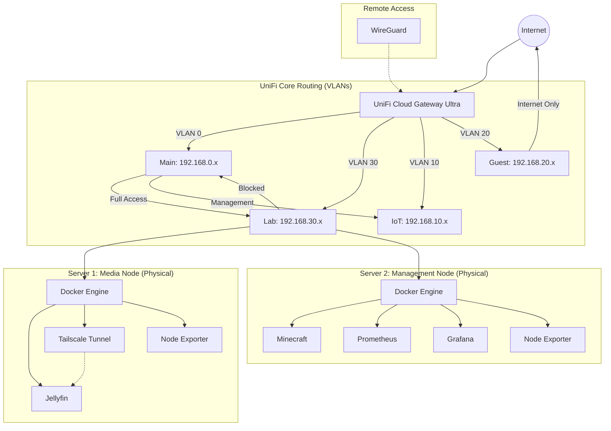

# 🚀 Enterprise Hybrid Homelab: Business & Media Ops
### Multi-Node Architecture | Zero Trust | Full Observability Stack
This repository serves as the **Infrastructure-as-Code (IaC)** foundation for a production-grade home network. It utilizes a **Split-Node** setup to separate high-intensity media streaming from core lab services and business operations, ensuring 99.9% uptime for critical tasks.
## 📐 1. Network Topology
The following diagram visualizes the traffic flow from the **UniFi UCG Ultra** gateway through the isolated VLAN segments and dual-node hardware stack.

### **VLAN & Firewall Configuration**
| VLAN ID | Name | Security Policy | Purpose |
|---|---|---|---|
| **0** | **Main** | **Trusted** | Etsy/eBay Business Ops, Admin Workstations. |
| **10** | **IoT** | **Strict** | 3D Printers, Smart Home Gear. No cross-VLAN access. |
| **20** | **Guest** | **Isolated** | Sandbox for visitors. Client isolation enabled. |
| **30** | **Lab** | **Monitored** | Infrastructure Nodes (Server 1 & Server 2). |

**Critical UniFi Firewall Rules:**
 1. **Allow Admin to All:** Source VLAN 0 → Destination Any (Action: Accept).
 2. **Isolate Lab:** Source VLAN 30 → Destination VLAN 0 (Action: **Drop**). *Protects business data from lab vulnerabilities.*
 3. **Guest Sandbox:** Source VLAN 20 → Destination Any/Local (Action: **Drop**).
## 🛠 2. Getting Started (Installation Guide)
### **Phase A: Server 1 (Media Head)**
This node handles high-bandwidth video transcoding and remote access.
 1. **Initialize Directories:** Create ~/jellyfin-data/config and ~/jellyfin-data/media.
 2. **Automation:** Create media.sh on this server to manage the Jellyfin lifecycle.
 3. **Launch:**
   ```bash
   chmod +x media.sh
   ./media.sh setup
   ./media.sh start
   
   ```
### **Phase B: Server 2 (Command Center)**
This node manages the global monitoring, gaming, and management tools.
 1. **Initialize Stack:**
   ```bash
   git clone https://github.com/ItsSpres/homelab.git
   cd homelab
   chmod +x lab.sh
   ./lab.sh setup
   
   ```
 2. **Start Services:**
   Launch the full stack or individual services:
   ```bash
   ./lab.sh start           # Starts Everything
   ./lab.sh start minecraft # Starts only Gaming
   
   ```
## 🕹 3. Master Automation Logic
### **The lab.sh Controller (Server 2)**
The Master Bash script on Server 2 provides granular control over the lab environment.
```bash
# Example Usage:
./lab.sh status    # View health of all containers
./lab.sh stop mc   # Take the Minecraft server offline for maintenance
./lab.sh shutdown  # Emergency full-system stop

```
### **The media.sh Controller (Server 1)**
The dedicated media script ensures **Tailscale** and **Jellyfin** are synchronized for remote users.
## 📊 4. Observability & Monitoring
The lab utilizes a **Prometheus/Grafana** pipeline to monitor both physical nodes from a single pane of glass.
 * **Scraping:** Prometheus (Server 2) reaches out to Node Exporters on both servers.
 * **Visualization:** Accessible at http://<Server-2-IP>:3000.
 * **Dashboard:** Import **ID 1860** for a real-time view of CPU usage, thermals, and memory across the entire network.
