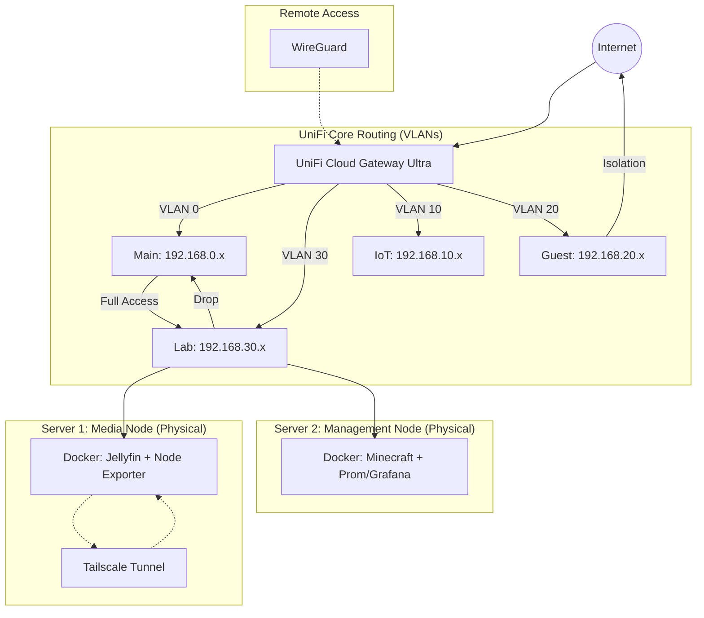

# 🚀 Enterprise Hybrid Homelab: Business & Media Ops
### Multi-Node Architecture | Zero Trust | Full Observability Stack
This repository serves as the **Infrastructure-as-Code (IaC)** foundation for a production-grade home network. It utilizes a **Split-Node Architecture** to separate high-intensity media streaming from core lab services and business operations, ensuring 99.9% uptime and strict security isolation.
## 📐 1. Network Topology & Security
The network relies on physical segmentation managed via the **UniFi Cloud Gateway Ultra (UCG Ultra)**.

### **VLAN Logic & Purpose**
| VLAN ID | Subnet | Security Policy | Purpose |
|---|---|---|---|
| **0** | 192.168.0.x | **Trusted** | Etsy/eBay Business Ops, Admin Workstations. |
| **10** | 192.168.10.x | **Strict** | 3D Printers (Isolated). |
| **20** | 192.168.20.x | **Isolated** | Guest Wi-Fi (Sandbox, no local access). |
| **30** | 192.168.30.x | **Monitored** | Infrastructure Nodes (Server 1 & Server 2). |
### **🛡️ Critical UniFi Firewall Rules**
To achieve enterprise-grade isolation, the following rules are applied in the UniFi Console (**Settings > Firewall & Security > LAN In**):
 1. **Allow Admin to All:** Source VLAN 0 → Destination Any (Action: **Accept**).
 2. **Isolate Lab:** Source VLAN 30 → Destination VLAN 0 (Action: **Drop**). *(Protects business data from lab vulnerabilities).*
 3. **Isolate IoT:** Source VLAN 10 → Destination Any (Action: **Drop**).
 4. **Guest Sandbox:** Source VLAN 20 → Destination Any Local Network (Action: **Drop**).
## 🏗️ 2. The Infrastructure Blueprints (YAML)
This lab relies on **Docker Compose**. The .yml files act as the blueprints for our containers, ensuring that if a server reboots, all services come back online exactly as configured.
### **Server 1 Blueprint (Media)**
This file (docker-compose.yml) handles the Jellyfin media server and a Node Exporter agent so Server 2 can monitor its health.
```yaml
services:
  jellyfin:
    image: jellyfin/jellyfin:latest
    container_name: jellyfin
    ports: ["8096:8096"]
    volumes:
      - ~/jellyfin-data/config:/config
      - ~/jellyfin-data/cache:/cache
      # IMPORTANT: Change this path to your actual media drive
      - /mnt/media:/media 
    restart: unless-stopped

  node-exporter:
    image: prom/node-exporter:latest
    container_name: node-exporter-s1
    ports: ["9100:9100"]
    restart: unless-stopped

```
### **Server 2 Blueprint (Command Center)**
This file (docker-compose.yml) hosts the gaming server and the centralized observability pipeline.
```yaml
services:
  minecraft:
    image: itzg/minecraft-bedrock-server
    container_name: minecraft-bedrock
    ports: ["19132:19132/udp"]
    environment: [EULA=TRUE]
    volumes: ["~/home-lab/mcdata:/data"]
    restart: unless-stopped

  prometheus:
    image: prom/prometheus:latest
    container_name: prometheus
    volumes: ["~/home-lab/prometheus/prometheus.yml:/etc/prometheus/prometheus.yml"]
    restart: unless-stopped

  grafana:
    image: grafana/grafana:latest
    container_name: grafana
    ports: ["3000:3000"]
    volumes: ["~/home-lab/grafana-data:/var/lib/grafana"]
    restart: unless-stopped

  node-exporter:
    image: prom/node-exporter:latest
    container_name: node-exporter
    ports: ["9100:9100"]
    restart: unless-stopped

```
## 🛠️ 3. Detailed Setup & Deployment Guide
### **Phase 1: Physical Network Prep**
 1. Log into your UniFi Console. Ensure ports connecting to Server 1 and Server 2 are assigned to **VLAN 30 (Lab)**.
 2. Assign **Static IPs** to both servers (e.g., Server 1 = 192.168.30.10, Server 2 = 192.168.30.11).
### **Phase 2: Deploying Server 1 (Media Head)**
Log into Server 1 via SSH or terminal.
 1. **Prepare Directory:** mkdir ~/media-stack && cd ~/media-stack
 2. **Create YAML Blueprint:** Create docker-compose.yml and paste the **Server 1 Blueprint** from above. Adjust the /mnt/media path to match your hard drive.
 3. **Create the Automation Controller (media.sh):**
   ```bash
   nano media.sh
   
   ```
   *Paste the following code:*
   ```bash
   #!/bin/bash
   # 🎬 Server 1: Media Controller
   set -e
   
   case "$1" in
       setup)
           mkdir -p ~/jellyfin-data/{config,cache,media}
           echo "✅ Media folders created. Ensure drives are mounted."
           ;;
       start)
           echo "⚡ Starting Tailscale & Jellyfin..."
           sudo tailscale up --accept-dns
           docker compose up -d
           ;;
       status)
           echo "📊 --- SERVER 1 STATUS ---"
           docker ps --format "table {{.Names}}\t{{.Status}}\t{{.Ports}}"
           tailscale status | head -n 1
           ;;
       stop)
           docker compose stop
           ;;
       *)
           echo "Usage: ./media.sh {setup|start|stop|status}"
           exit 1
   esac
   
   ```
 4. **Execute Deployment:**
   ```bash
   chmod +x media.sh
   ./media.sh setup
   ./media.sh start
   
   ```
### **Phase 3: Deploying Server 2 (Command Center)**
Log into Server 2 via SSH or terminal.
 1. **Prepare Directory:** mkdir ~/lab-stack && cd ~/lab-stack
 2. **Create YAML Blueprint:** Create docker-compose.yml and paste the **Server 2 Blueprint** from above.
 3. **Create the Automation Controller (lab.sh):**
   ```bash
   nano lab.sh
   
   ```
   *Paste the following code:*
   ```bash
   #!/bin/bash
   # 🚀 Server 2: Master Lab Controller
   set -e
   
   LAB_DIR="$HOME/home-lab"
   
   case "$1" in
       setup)
           echo "🏗️  Initializing Directories..."
           mkdir -p $LAB_DIR/{mcdata,grafana-data,prometheus}
   
           if [ ! -f $LAB_DIR/prometheus/prometheus.yml ]; then
             cat <<EOF > $LAB_DIR/prometheus/prometheus.yml
   global: {scrape_interval: 15s}
   scrape_configs:
     - job_name: 'server-2-lab'
       static_configs:
         - targets: ['localhost:9100']
     - job_name: 'server-1-media'
       static_configs:
         - targets: ['SERVER_1_IP_HERE:9100']
   EOF
           fi
           echo "✅ Setup Complete. Edit $LAB_DIR/prometheus/prometheus.yml with Server 1's exact IP."
           ;;
       start)
           if [ -z "$2" ]; then
               echo "⚡ Starting ALL Lab services..."
               docker compose up -d
           else
               echo "📦 Starting individual service: $2..."
               docker compose up -d "$2"
           fi
           ;;
       status)
           echo "📊 --- SERVER 2 STATUS ---"
           docker ps --format "table {{.Names}}\t{{.Status}}\t{{.Ports}}"
           ;;
       stop)
           if [ -z "$2" ]; then
               docker compose stop
           else
               docker compose stop "$2"
           fi
           ;;
       *)
           echo "Usage: ./lab.sh {setup|start|stop|status}"
           exit 1
   esac
   
   ```
 4. **Execute Deployment:**
   ```bash
   chmod +x lab.sh
   ./lab.sh setup
   
   ```
 5. **Link the Servers:** Open ~/home-lab/prometheus/prometheus.yml and replace SERVER_1_IP_HERE with Server 1's actual static IP.
 6. **Start the Stack:**
   ```bash
   ./lab.sh start
   
   ```
## 🕹️ 4. Day-to-Day Operations
Your infrastructure is now fully code-managed. Use your Bash controllers to manage resources efficiently:
 * **Start specific service to save RAM (Server 2):** ./lab.sh start minecraft
 * **Stop a specific service (Server 2):** ./lab.sh stop grafana
 * **Check global health (Server 1 or 2):** ./lab.sh status or ./media.sh status
## 📊 5. Activating the Observability Pipeline
To visualize the health data being scraped from both servers:
 1. Navigate to http://<Server-2-IP>:3000 in your browser.
 2. Log in to Grafana (Default credentials: admin / admin).
 3. Go to **Connections > Data Sources > Add Data Source**.
 4. Select **Prometheus**. Set the connection URL to http://prometheus:9090. Save & Test.
 5. Go to **Dashboards > Import**. Enter Dashboard ID **1860** (Node Exporter Full) and assign your Prometheus data source.
 6. *Result: You now have a studio-grade, real-time visual monitor of both physical servers' CPU, RAM, and thermals.*
