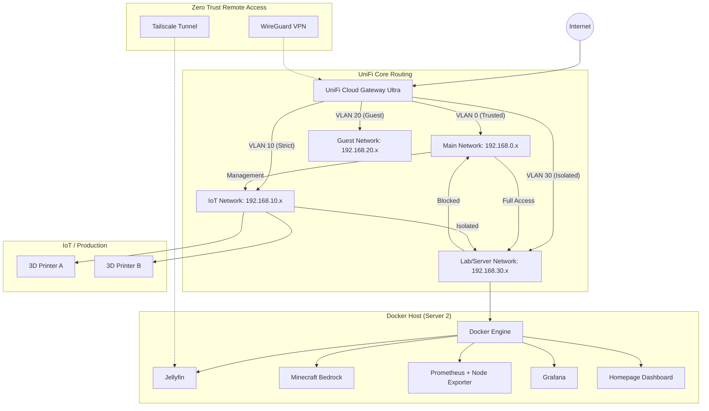

# 🚀 Enterprise-Grade Hybrid Homelab & Business Ops
### Zero Trust Networking | Multi-VLAN | Full Observability Stack

This repository contains the **Infrastructure-as-Code (IaC)** and automation logic for a secure, multi-layered home network. It balances **Etsy/eBay business security** with a high-performance **Observability** stack for media and gaming.

---

## 📐 1. Network Topology (UniFi Ecosystem)
Managed via **UniFi Cloud Gateway Ultra (UCG Ultra)** and segmented into four isolated VLANs.

| VLAN | Subnet | Name | Security Policy |
| :--- | :--- | :--- | :--- |
| **0** | `192.168.0.x` | **Main** | **Admin Zone:** Full access; hosts Etsy/eBay workstations. |
| **30** | `192.168.30.x` | **Lab** | **Engine Room:** Docker, Minecraft, Jellyfin. Blocked from Main. |
| **10** | `192.168.10.x` | **IoT** | **Isolated:** 3D Printers. No cross-VLAN communication. |
| **20** | `192.168.20.x` | **Guest** | **Sandbox:** Internet only; client isolation enabled. |




### 🔐 Zero Trust Remote Access
- **WireGuard:** Direct Admin VPN to the UCG Ultra for full-network management.
- **Tailscale:** Deployed on **Server 1 (Media)**. External users land directly in Jellyfin, isolated from the rest of the lab.

---

## 🐳 2. The Infrastructure Stack (`docker-compose.yml`)
This stack includes the **Prometheus/Grafana** pipeline required for actual monitoring.

```yaml
services:
  # --- Media & Gaming ---
  jellyfin:
    image: jellyfin/jellyfin:latest
    container_name: jellyfin
    restart: unless-stopped
    ports: ["8096:8096"]
    volumes:
      - ~/home-lab/jellyfin-config:/config
      - ~/home-lab/jellyfin-media:/media

  minecraft:
    image: itzg/minecraft-bedrock-server
    container_name: minecraft-bedrock
    restart: unless-stopped
    ports: ["19132:19132/udp"]
    environment: [EULA=TRUE]
    volumes: ["~/home-lab/mcdata:/data"]

  # --- Observability (The Monitoring Brain) ---
  prometheus:
    image: prom/prometheus:latest
    container_name: prometheus
    restart: unless-stopped
    volumes:
      - ~/home-lab/prometheus/prometheus.yml:/etc/prometheus/prometheus.yml
    command: ["--config.file=/etc/prometheus/prometheus.yml"]

  node-exporter:
    image: prom/node-exporter:latest
    container_name: node-exporter
    restart: unless-stopped
    ports: ["9100:9100"] # This feeds your CPU/RAM data to Prometheus

  grafana:
    image: grafana/grafana:latest
    container_name: grafana
    restart: unless-stopped
    ports: ["3000:3000"]
    volumes: ["~/home-lab/grafana-data:/var/lib/grafana"]

  # --- Management ---
  portainer:
    image: portainer/portainer-ce:latest
    container_name: portainer
    restart: unless-stopped
    ports: ["9000:9000"]
    volumes: ["/var/run/docker.sock:/var/run/docker.sock"]

```
## 🛠 3. Master Automation Script (lab.sh)
Unified script for setup, firewall, and service management.
```bash
#!/bin/bash
# 🚀 Master Lab Controller - ItsSpres Homelab v3.0
set -e

LAB_DIR="$HOME/home-lab"
COMPOSE_FILE="$HOME/homelab/docker-compose.yml"

case "$1" in
    setup)
        echo "🏗️  Initializing local directories..."
        mkdir -p $LAB_DIR/{mcdata,jellyfin-config,jellyfin-media,portainer-data,grafana-data,prometheus}
        sudo chown -R $USER:$USER $LAB_DIR
        
        # Create Prometheus Config so it works out of the box
        if [ ! -f $LAB_DIR/prometheus/prometheus.yml ]; then
          cat <<EOF > $LAB_DIR/prometheus/prometheus.yml
global:
  scrape_interval: 15s
scrape_configs:
  - job_name: 'node'
    static_configs:
      - targets: ['node-exporter:9100']
EOF
        fi
        echo "✅ Setup Complete."
        ;;
    start)
        echo "⚡ Powering up Lab..."
        sudo systemctl start tailscaled
        sudo tailscale up --accept-dns
        sudo ufw allow 19132/udp && sudo ufw allow 8096/tcp && sudo ufw allow 3000/tcp
        sudo ufw reload
        docker compose -f $COMPOSE_FILE up -d
        echo "🚀 LAB IS ONLINE."
        ;;
    stop)
        echo "🛑 Shutting down Lab..."
        docker compose -f $COMPOSE_FILE stop
        echo "🔒 LAB IS OFFLINE."
        ;;
    *)
        echo "Usage: ./lab.sh {setup|start|stop}"
        exit 1
esac

```
