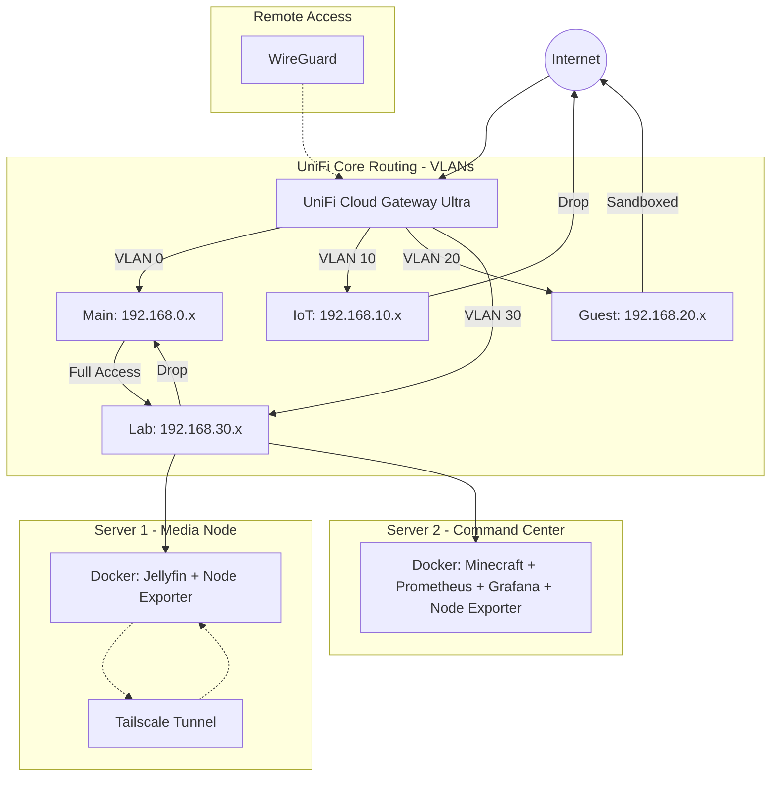

# 🚀 Enterprise Hybrid Homelab: Business & Media Ops

### Multi-Node Architecture | Zero Trust | Full Observability Stack

This repository is the **Infrastructure-as-Code (IaC)** foundation for a production-grade home network built on a **Split-Node Architecture**. High-intensity media streaming is physically separated from core lab services and business operations — ensuring maximum uptime, strict security isolation, and clean resource allocation across dedicated hardware.

-----

## 📋 Table of Contents

1. [Architecture Overview](#-architecture-overview)
1. [Network Topology & Security](#-network-topology--security)
1. [Repository Structure](#-repository-structure)
1. [Prerequisites](#-prerequisites)
1. [Deployment Guide](#-deployment-guide)
1. [Automation Controllers](#-automation-controllers)
1. [Observability Pipeline](#-observability-pipeline)
1. [Day-to-Day Operations](#-day-to-day-operations)
1. [Troubleshooting Runbook](#-troubleshooting-runbook)
1. [Service Port Reference](#-service-port-reference)

-----

## 🏛️ Architecture Overview

This lab uses two dedicated physical servers with clearly separated responsibilities:

|Node        |Role          |Key Services                                 |
|------------|--------------|---------------------------------------------|
|**Server 1**|Media Node    |Jellyfin, Node Exporter, Tailscale           |
|**Server 2**|Command Center|Minecraft, Prometheus, Grafana, Node Exporter|

**Design principles:**

- Media streaming workloads are isolated to Server 1 to prevent I/O from impacting lab performance
- All monitoring and metrics aggregation is centralized on Server 2
- Both nodes report health metrics via Node Exporter to a single Prometheus/Grafana observability stack
- Remote access uses **Tailscale** as the primary zero trust layer; **WireGuard** is maintained as a secondary fallback via the UniFi gateway

-----

## 📐 Network Topology & Security

Physical network segmentation is managed by the **UniFi Cloud Gateway Ultra (UCG Ultra)**.



### VLAN Reference

|VLAN ID|Subnet      |Security Policy|Purpose                                         |
|-------|------------|---------------|------------------------------------------------|
|**0**  |192.168.0.x |**Trusted**    |Business ops (Etsy/eBay), admin workstations    |
|**10** |192.168.10.x|**Strict**     |IoT devices — 3D printers (fully isolated)      |
|**20** |192.168.20.x|**Isolated**   |Guest Wi-Fi — sandboxed, no local network access|
|**30** |192.168.30.x|**Monitored**  |Lab infrastructure — Server 1 and Server 2      |

### UniFi Firewall Rules

Configured in UniFi Console: **Settings > Firewall & Security > LAN In**

|#|Rule                  |Source |Destination|Action    |
|-|----------------------|-------|-----------|----------|
|1|Allow Admin to All    |VLAN 0 |Any        |**Accept**|
|2|Isolate Lab from Admin|VLAN 30|VLAN 0     |**Drop**  |
|3|Isolate IoT           |VLAN 10|Any        |**Drop**  |
|4|Guest Sandbox         |VLAN 20|Any Local  |**Drop**  |


> **Rule 2 rationale:** Prevents lab vulnerabilities from reaching trusted business operations on VLAN 0. Admin can reach the lab; the lab cannot reach admin.

-----

## 📁 Repository Structure

```
Home-Lab/
│
├── README.md                    # This file — full documentation
│
├── server-1-compose.yml         # Server 1: Jellyfin + Node Exporter
├── server-1.sh                  # Server 1: Automation controller
│
├── server-2-compose.yml         # Server 2: Minecraft + Prometheus + Grafana + Node Exporter
└── server-2.sh                  # Server 2: Automation controller
```

Each server has a matched pair: a **Docker Compose blueprint** defining what runs, and a **Bash controller** managing how it runs.

-----

## ✅ Prerequisites

### Both Servers

**Docker**

```bash
curl -fsSL https://get.docker.com -o get-docker.sh
sudo sh get-docker.sh
sudo usermod -aG docker $USER
newgrp docker
```

Verify Docker Compose is available:

```bash
docker compose version
```

### Server 1 Only

**Tailscale** (zero trust remote access)

```bash
curl -fsSL https://tailscale.com/install.sh | sh
sudo tailscale up --accept-dns
```

### Network Prep (UniFi Console)

Before deploying, complete these steps in your UniFi Console:

1. Assign static IPs to both servers within VLAN 30:
- Server 1: `192.168.30.10`
- Server 2: `192.168.30.11`
1. Confirm the switch ports for both servers are tagged to **VLAN 30 (Lab)**
1. Verify firewall rules are applied as documented above

-----

## 🚀 Deployment Guide

### Phase 1 — Deploy Server 1 (Media Node)

SSH into Server 1 or open a terminal directly.

**Step 1: Clone the repository**

```bash
git clone https://github.com/ItsSpres/Home-Lab.git ~/home-lab
cd ~/home-lab
chmod +x server-1.sh
```

**Step 2: Run setup**

```bash
./server-1.sh setup
```

Creates Jellyfin data directories and confirms what needs to be configured.

**Step 3: Update the media volume path**

Open `server-1-compose.yml` and replace the placeholder with your actual media drive path:

```yaml
# Before:
- /your/media/path:/media

# After (example):
- /mnt/media:/media
```

To find your drive’s mount path:

```bash
lsblk
# or
df -h
```

**Step 4: Start Server 1**

```bash
./server-1.sh start
```

**Step 5: Verify**

```bash
./server-1.sh status
```

Jellyfin will be available at: `http://192.168.30.10:8096`

-----

### Phase 2 — Deploy Server 2 (Command Center)

SSH into Server 2 or open a terminal directly.

**Step 1: Clone the repository**

```bash
git clone https://github.com/ItsSpres/Home-Lab.git ~/home-lab
cd ~/home-lab
chmod +x server-2.sh
```

**Step 2: Run setup**

```bash
./server-2.sh setup
```

Creates required directories and generates a default `prometheus.yml` with placeholder IPs.

**Step 3: Update prometheus.yml with Server 1’s IP**

```bash
nano ~/home-lab/prometheus/prometheus.yml
```

Replace `SERVER_1_IP_HERE` with Server 1’s static IP:

```yaml
# Before:
- targets: ['SERVER_1_IP_HERE:9100']

# After:
- targets: ['192.168.30.10:9100']
```

**Step 4: Start Server 2**

```bash
./server-2.sh start
```

**Step 5: Verify**

```bash
./server-2.sh status
```

**Step 6: Complete Grafana setup**

See [Observability Pipeline](#-observability-pipeline) below.

-----

## 🎮 Automation Controllers

Both servers are managed by their respective Bash controllers. Each uses a consistent command interface.

### server-1.sh — Media Node

```
Usage: ./server-1.sh {command} [service]

  setup    Create directories and confirm configuration
  start    Start Tailscale and all containers
  stop     Stop all containers
  restart  Stop then restart all containers
  status   Show container state, Tailscale status, and service URLs
  logs     Stream logs for all services
           ./server-1.sh logs [service-name]
```

### server-2.sh — Command Center

```
Usage: ./server-2.sh {command} [service]

  setup              Create directories and generate prometheus.yml
  start [service]    Start all containers, or a specific service
  stop [service]     Stop all containers, or a specific service
  restart [service]  Restart all containers, or a specific service
  status             Show container state, prometheus config check, and URLs
  logs [service]     Stream logs for all services or a specific one

Examples:
  ./server-2.sh start                 # Start everything
  ./server-2.sh start minecraft       # Start only Minecraft
  ./server-2.sh stop grafana          # Stop only Grafana
  ./server-2.sh logs prometheus       # Tail Prometheus logs
  ./server-2.sh restart prometheus    # Restart Prometheus after config change
```

-----

## 📊 Observability Pipeline

Server 2 runs a centralized monitoring stack that aggregates health metrics from **both physical servers**.

```
Server 1: Node Exporter (:9100) ──┐
                                   ├──► Prometheus (:9090) ──► Grafana (:3000)
Server 2: Node Exporter (:9100) ──┘
```

### Step 1 — Activate Grafana

1. Open Grafana: `http://192.168.30.11:3000`
1. Log in — default credentials: `admin` / `admin`
1. **Change the password immediately**

### Step 2 — Add Prometheus as a Data Source

1. Go to **Connections > Data Sources > Add Data Source**
1. Select **Prometheus**
1. Set the URL to: `http://prometheus:9090`
1. Click **Save & Test** — confirm success

### Step 3 — Import the Monitoring Dashboard

1. Go to **Dashboards > Import**
1. Enter Dashboard ID: **1860** (Node Exporter Full)
1. Assign your Prometheus data source
1. Click **Import**

Result: Real-time CPU, RAM, disk I/O, and network metrics for both servers on a single dashboard.

### Step 4 — Verify Both Nodes are Being Scraped

1. Open Prometheus: `http://192.168.30.11:9090`
1. Navigate to **Status > Targets**
1. Confirm both `server-1-media` and `server-2-lab` show **State: UP**

-----

## 🕹️ Day-to-Day Operations

```bash
# Check health of both servers
./server-1.sh status
./server-2.sh status

# Start a specific service without affecting others
./server-2.sh start minecraft
./server-2.sh start grafana

# Stop a resource-heavy service temporarily
./server-2.sh stop minecraft

# View live logs for a specific service
./server-2.sh logs grafana
./server-1.sh logs jellyfin

# Restart Prometheus after editing prometheus.yml
./server-2.sh restart prometheus

# Full restart of all Server 2 services
./server-2.sh restart
```

-----

## 🔧 Troubleshooting Runbook

### Container won’t start

```bash
# List all containers including stopped ones
docker ps -a

# View error output from the failing container
./server-2.sh logs [container-name]

# Check for port conflicts
sudo ss -tulnp | grep [port]

# Force recreate without touching data volumes
docker compose -f server-2-compose.yml up -d --force-recreate [service]
```

-----

### Jellyfin not accessible

```bash
# Confirm container is running
./server-1.sh status

# Check Jellyfin logs for errors
./server-1.sh logs jellyfin

# Confirm port 8096 is listening
sudo ss -tulnp | grep 8096

# Verify media volume path is set correctly
cat server-1-compose.yml | grep media
```

-----

### Tailscale connection dropped (Server 1)

```bash
# Check current Tailscale status
tailscale status

# Re-authenticate and reconnect
sudo tailscale up --accept-dns

# If the Tailscale daemon is not running
sudo systemctl start tailscaled
sudo systemctl enable tailscaled
```

-----

### Prometheus not scraping Server 1

```bash
# Test direct connectivity from Server 2 to Server 1 Node Exporter
curl http://192.168.30.10:9100/metrics

# Verify the IP in prometheus.yml is correct
cat ~/home-lab/prometheus/prometheus.yml

# Restart Prometheus to reload config after any changes
./server-2.sh restart prometheus

# Check target status in Prometheus UI
# http://192.168.30.11:9090/targets
```

-----

### Grafana shows no data

```bash
# Confirm Prometheus is running
./server-2.sh status

# Verify data source URL in Grafana UI:
# Settings > Data Sources > Prometheus > URL = http://prometheus:9090

# Test Prometheus API directly
curl "http://192.168.30.11:9090/api/v1/query?query=up"
```

-----

### Docker service not running after reboot

```bash
# Check Docker daemon status
sudo systemctl status docker

# Start and enable Docker
sudo systemctl start docker
sudo systemctl enable docker

# Restart all containers
./server-2.sh start
./server-1.sh start
```

-----

### Full environment rebuild from scratch

```bash
# Stop all containers on each server
./server-2.sh stop
./server-1.sh stop

# Remove containers (data volumes are preserved in ~/home-lab and ~/jellyfin-data)
docker compose -f server-2-compose.yml down
docker compose -f server-1-compose.yml down

# Re-run setup and redeploy
./server-2.sh setup
./server-2.sh start

./server-1.sh setup
./server-1.sh start
```

-----

## 📦 Service Port Reference

|Service          |Server  |Port |Protocol|
|-----------------|--------|-----|--------|
|Jellyfin         |Server 1|8096 |TCP     |
|Node Exporter    |Server 1|9100 |TCP     |
|Minecraft Bedrock|Server 2|19132|UDP     |
|Prometheus       |Server 2|9090 |TCP     |
|Grafana          |Server 2|3000 |TCP     |
|Node Exporter    |Server 2|9100 |TCP     |

-----

## 🔗 Dependencies & References

- Docker Install: https://get.docker.com
- Tailscale Install: https://tailscale.com/install
- Grafana Dashboard 1860: https://grafana.com/grafana/dashboards/1860
- UniFi Documentation: https://help.ui.com
